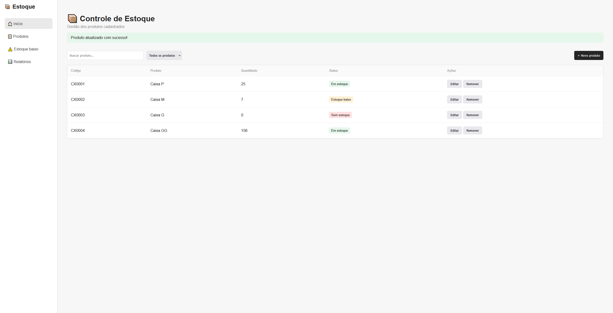

# Controle de Estoque

Aplicação web para gerenciamento de estoque desenvolvida com **Python, Flask e JavaScript**.

O sistema permite cadastrar, editar, remover e acompanhar produtos através de uma interface web, incluindo validação de dados, classificação automática do estoque e persistência local das informações.

O projeto foi desenvolvido a partir de um cenário de controle de estoque e almoxarifado, aplicando conceitos de desenvolvimento web, organização de dados e versionamento de código.

> **Status:** Em desenvolvimento

---

## Demonstração



---

## Funcionalidades

Atualmente, a aplicação possui:

- Cadastro de produtos
- Edição de produtos
- Remoção com confirmação
- Validação de códigos duplicados
- Normalização dos códigos para letras maiúsculas
- Limite de 6 caracteres para códigos
- Validação de quantidade
- Bloqueio de quantidades negativas
- Identificação automática do status do estoque
- Mensagens de sucesso e erro
- Persistência dos dados em JSON

### Classificação do estoque

| Status | Regra |
| --- | --- |
| Em estoque | 10 unidades ou mais |
| Estoque baixo | Entre 1 e 9 unidades |
| Sem estoque | 0 unidades |

---

## Tecnologias

| Tecnologia | Utilização |
| --- | --- |
| Python | Regras e lógica da aplicação |
| Flask | Backend, rotas e processamento das requisições |
| Jinja2 | Renderização dinâmica dos dados no HTML |
| HTML5 | Estrutura da interface |
| CSS3 | Estilização da aplicação |
| JavaScript | Modais, confirmações e interações da interface |
| JSON | Persistência local dos produtos |
| Git | Controle de versão |
| GitHub | Hospedagem e histórico do repositório |

---

## Como funciona

Cada produto possui três informações principais:

```text
codigo
nome
quantidade
```

A interface envia os dados através de formulários HTML para as rotas do Flask.

O backend valida os dados recebidos, modifica a lista de produtos e salva as alterações no arquivo JSON.

```text
Navegador
    |
    v
HTML / CSS / JavaScript
    |
    v
Flask
    |
    v
Lógica em Python
    |
    v
estoque.json
```

Ao carregar a página, o Flask lê os produtos armazenados e utiliza Jinja2 para gerar dinamicamente a tabela exibida ao usuário.

---

## Estrutura do projeto

```text
controle-estoque/
|
|-- docs/
|   `-- images/
|       `-- dashboard.png
|
|-- static/
|   |-- css/
|   |   `-- style.css
|   `-- js/
|       `-- script.js
|
|-- templates/
|   `-- index.html
|
|-- app.py
|-- requirements.txt
|-- .gitignore
`-- README.md
```

---

## Executando o projeto

### Pré-requisitos

É necessário ter instalado:

- Python 3
- Git

### 1. Clone o repositório

```bash
git clone https://github.com/Atrhx/controle-estoque.git
```

Entre na pasta:

```bash
cd controle-estoque
```

### 2. Crie um ambiente virtual

```bash
python -m venv .venv
```

### Windows PowerShell

Caso a execução de scripts esteja bloqueada, libere temporariamente apenas para a sessão atual:

```powershell
Set-ExecutionPolicy -Scope Process -ExecutionPolicy Bypass
```

Ative o ambiente virtual:

```powershell
.\.venv\Scripts\Activate.ps1
```

### Windows CMD

```cmd
.venv\Scripts\activate.bat
```

### 3. Instale as dependências

```bash
python -m pip install -r requirements.txt
```

### 4. Execute a aplicação

```bash
python app.py
```

A aplicação estará disponível em:

```text
http://127.0.0.1:5000
```

---

## Próximas melhorias

- [ ] Busca de produtos
- [ ] Filtro por status do estoque
- [ ] Página dedicada a produtos com estoque baixo
- [ ] Relatórios de estoque
- [ ] Melhorias de responsividade
- [ ] Migração da persistência em JSON para SQLite
- [ ] Deploy da aplicação

---

## Conceitos aplicados

Durante o desenvolvimento foram aplicados conceitos como:

- CRUD
- Rotas HTTP
- Requisições `GET` e `POST`
- Formulários HTML
- Validação de dados no frontend e backend
- Listas e dicionários em Python
- Leitura e escrita de arquivos JSON
- Templates com Jinja2
- Manipulação do DOM com JavaScript
- Ambientes virtuais Python
- Git e GitHub
- Branches
- Commits e versionamento incremental

---

## Evolução do projeto

O projeto começou como uma aplicação executada pelo terminal, utilizada para praticar lógica de programação e persistência de dados.

Posteriormente, a aplicação foi evoluída para uma interface web utilizando Flask, HTML, CSS e JavaScript.

O histórico dessa evolução permanece disponível nos commits do repositório.

---

## Autor

**Arthur Guilherme**

Projeto desenvolvido para portfólio durante meus estudos de desenvolvimento web com Python.